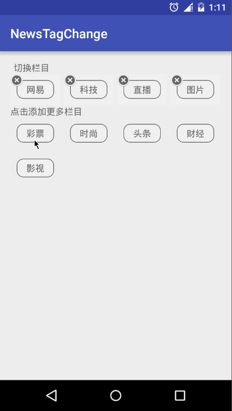

### NewsTagChange

拖拽重排GridView的新闻Demo

#### 简介

用过网易新闻ios端的同学可能都知道，新闻栏目是可以按自己喜好增添排序的。如下图：

而这个项目就是在Android端用自定义GridView来实现新闻栏目拖拽重排效果。项目的初衷主要给Android入门新人展示一下一个自定义View的由简单到复杂的迭代流程，所以我为项目分版本，具体看下面版本说明，便于新人们由浅到深的学习思考。（项目现在仍在继续迭代中...）

#### 版本说明
1.v1.0 基本实现拖拽重排效果，但没有加入动画效果。v1.0效果图：

#### 未完待续...
