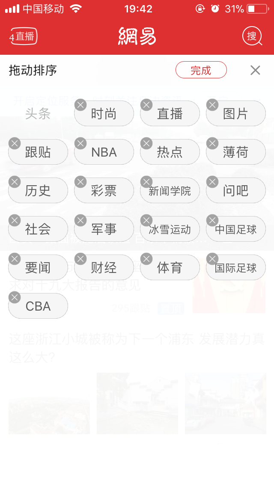
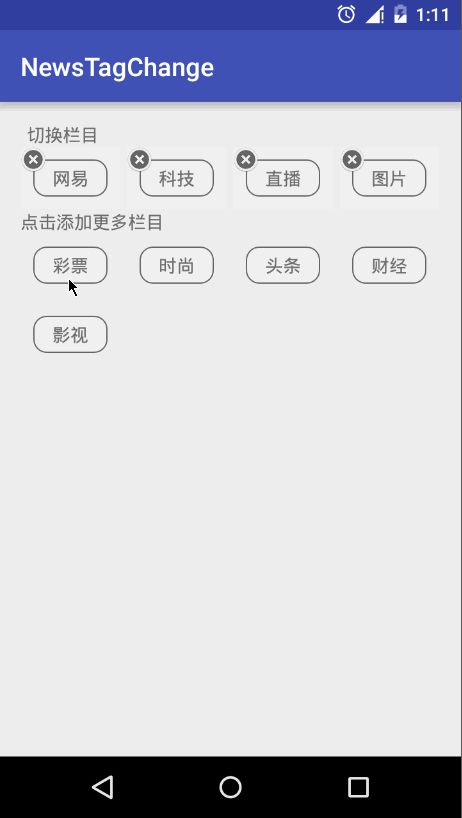
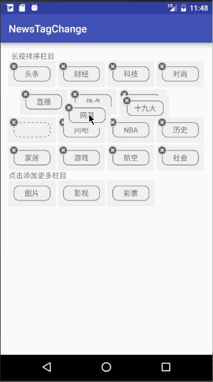

### NewsTagChange

拖拽重排GridView的Demo

#### 简介

用过网易新闻的同学可能都知道，Net易新闻TAG是可以按自己喜好增添排序的。如下图：

		

而这个项目就是自定义GridView来实现新闻栏目拖拽重排效果。项目的初衷主要给Android新人展示一下一个自定义View的由简单到复杂的迭代流程，所以我为项目分版本，具体看下面版本说明，便于由浅到深的学习思考。

#### 版本说明

1. v1.0 基本实现拖拽重排效果，但没有加入动画效果。效果图如下：

		

2.  v2.0 加入了重排动画和放置动画。效果图如下：

		

#### 未完待续...
